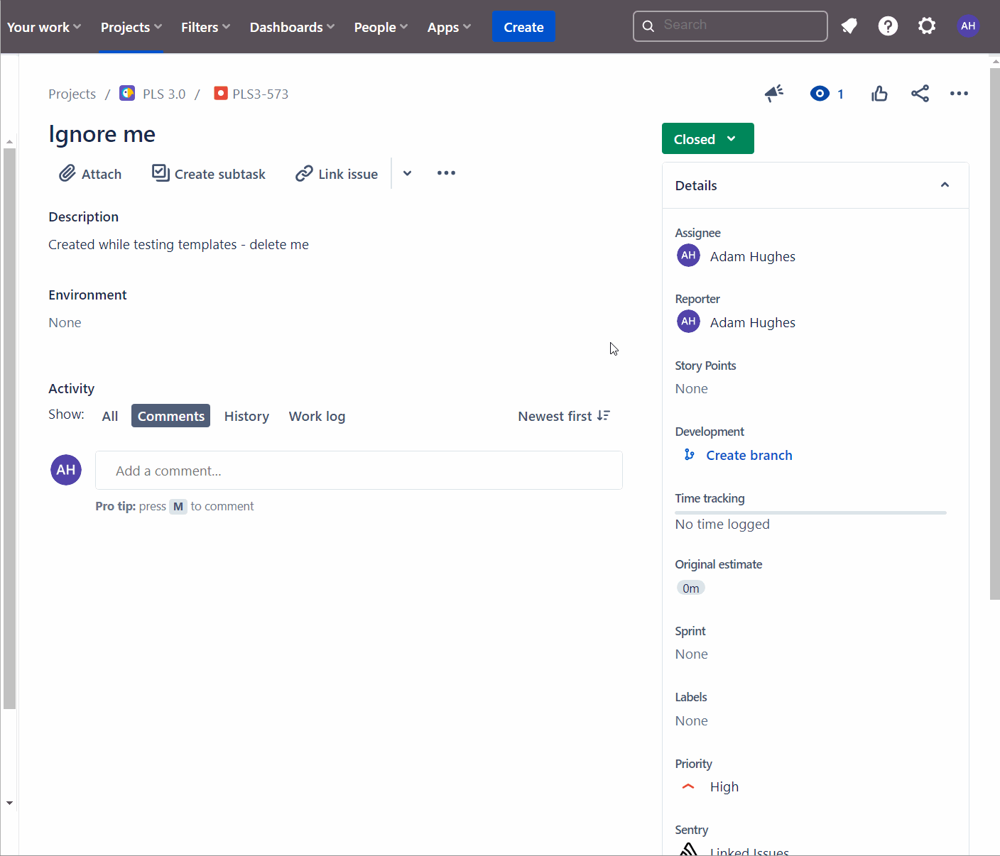

# Issue Template Examples for Jira

To use, simply copy the raw contents of a template into Jira create ticket edit screen as shown below; in this case copying `bug-tempalte.txt`.  Once created, the ticket will be
pre-filled with content.  Rather than copy/pasting every time, consider managing with a Jira template plugin such as [Easy Templates for Jira Issues](https://marketplace.atlassian.com/apps/1219112/easy-templates-for-jira-issues?hosting=cloud&tab=overview).

Got any cool template ideas?  Feel free to PR.